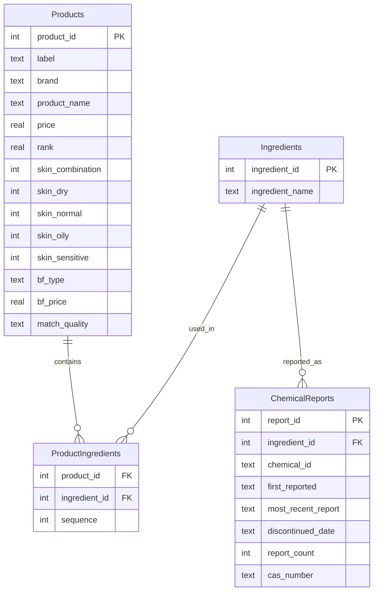

# Beauty Wizard: Cosmetic Ingredient Analysis

## Project Summary

Beauty Wizard is a data analytics project focused on examining cosmetic product formulations, ingredient patterns, brand trends, and chemical safety. The project integrates retail product data, ingredient sources, and government chemical reporting into a unified relational database for analysis. The goal is to support informed consumer decision-making, improve ingredient transparency, and analyze how formulations relate to pricing, brand identity, and safety outcomes.

This analysis explores how cosmetic ingredients are used across products and brands, highlighting formulation complexity and regulatory signals. Results show that a small
number of ingredients dominate formulations, while regulatory reporting is concentrated among a limited subset of chemicals.

This work includes data cleaning, database design, exploratory analysis, and the development of new metrics such as safety scores and ingredient diversity.

---

## Version Control

This project was developed using Git and GitHub with frequent, incremental commits. All commits were made via the command line in accordance with project requirements.

---

## Goals

Minimum goals:

- Identify the most common cosmetic ingredients
- Compare products by category (e.g., cleanser vs. moisturizer)
- Analyze ingredient counts per product
- Determine highest and lowest ranked brands based on dataset criteria

Expanded goals:

- Correlate product composition with price, popularity, and safety scores
- Identify brands with high transparency or frequent use of flagged chemicals
- Compare ingredient patterns across product categories
- Track controversial chemicals over time

---

## Data Sources

This project draws from several datasets:

| Source | Format | Purpose | Filename
|--------|--------|---------|----------|
| [Sephora Skincare Product Ingredients (Kaggle)](https://www.kaggle.com/datasets/dominoweir/skincare-product-ingredients) | CSV | Retail product listings and ingredient text | cosmetic_p.csv |
| [BeautyFeeds Skincare & Haircare Dataset](https://app.beautyfeeds.io/sample_datasets/skincare-hair-care-products-with-ingredients?_gl=1*15a4fvl*_ga*MjM1OTEyMDE3LjE3NjE2Nzg1NTY.*_ga_19C9HP125W*czE3NjE2Nzg1NTYkbzEkZzEkdDE3NjE2Nzg1OTkkajE3JGwwJGgw) | Cloud dataset converted to CSV | Supplementary product and ingredient details | BeautyFeeds.csv |
| [California Chemicals in Cosmetics](https://data.chhs.ca.gov/dataset/chemicals-in-cosmetics) | Government dataset | Chemical reporting, flagged substances, discontinuation dates | cscpopendata.csv |

The combined datasets exceed 1,000 rows and 10 columns. All datasets were cleaned, standardized, and integrated into a relational database for analysis.

---

### Database Architecture and Workflow

BeautyWizard separates database schema definition, data loading, and analysis to improve clarity, reproducibility, and safety.

A relational schema was designed to model products, ingredients, and their many-to-many relationships. Separate tables for hazard and regulatory data allow external signals to be linked without duplicating product records.

The schema is defined in a standalone script (`create_beautywiz_db.py`) rather than embedded in a notebook. This ensures schema creation is intentional and repeatable, and avoids accidental re-execution during exploratory analysis. It also reflects real-world data workflows, where database structure is managed independently from analytics code.

Data ingestion is handled by a dedicated ETL (extract, transform, load (data)) script, while Jupyter notebooks focus on querying the database, performing analysis, and producing visualizations. This separation keeps notebooks readable and supports scalable, well-organized analytical development.

---

## Database Schema (Entity Relationship Diagram)

The Beauty Wizard project uses a relational database to normalize cosmetic product, ingredient, and chemical report data. This schema supports ingredient-level transparency, reuse of ingredients across products, and regulatory risk analysis.

---

### Schema Overview

**Products**  
Stores cosmetic product metadata, including brand, price, ranking, and skin-type compatibility indicators.

**Ingredients**  
A normalized lookup table of unique cosmetic ingredients used across all products.

**ProductIngredients**  
A junction table that resolves the many-to-many relationship between products and ingredients.  
The `sequence` field preserves ingredient order as listed on product labels.

**ChemicalReports**  
Stores regulatory and safety-related reporting data associated with specific ingredients, enabling risk and compliance analysis.

---

## Methodology

### Standardization and Cleaning

- Converted identifiers to `snake_case`
- Normalized brand and product names
- Tokenized and standardized ingredient lists

### Missing Data Strategy

| Type | Method |
|------|--------|
| Numeric fields (e.g., price) | Median imputation by category or brand |
| Categorical fields | Assigned "Unknown" values |
| Missing key identifiers | Dropped to maintain relational integrity |

### Derived Metrics

- Ingredient Diversity Index (unique ingredients per product)
- Safety Score (weighted presence of flagged chemicals)
- Ingredient Frequency Rank (cross-dataset prevalence)

### Outlier Treatment

- Identified extreme price values
- Retained valid luxury-priced items
- Flagged anomalies for review rather than discarding

---

## Custom Functions

This project includes custom Python functions to automate repetitive tasks,
including column normalization, ingredient parsing, and database population.
These functions improve code reuse, readability, and reproducibility.

---

## Planned Analyses

Initial goals:

- Price distribution comparisons across brands and categories
- Ingredient frequency analysis across datasets
- Correlation between safety score and price or popularity
- Chemical reporting trends over time

Stretch goals:

- Sentiment analysis using public beauty feeds or reviews
- Comparison with regulatory data (FDA, EWG)
- Automated pipeline for data refresh

---

## Tools and Technologies

- Python
- Pandas
- Matplotlib, Seaborn
- NumPy
- Requests
- SQLite and SQL schema design
- Jupyter Notebook
- Regex and text-processing methods

---

## Repository Structure

beauty_wizard
/data (datasets)
/notebook EDA, transformations, visualizations
/schema ER diagrams and SQL scripts
/scripts ETL and data cleaning utilities
README.md

---

## Current Status

| Task | Status |
|------|--------|
| Dataset acquisition | Complete |
| Initial cleaning and normalization | Complete |
| Schema design and table joining | Complete |
| Core analysis functions | In progress |
| Visualizations | In progress |
| Safety and diversity scoring | Upcoming |

---

## Contributing

Contributions, dataset suggestions, and methodology feedback are welcome. Please open an issue or submit a pull request.

---

## Project Vision

Beauty Wizard advances ingredient transparency and data-driven beauty research. Empowering consumers with smarter, safer, more sustainable choices.

---

*This project used ChatGPT for code review, debugging assistance, and README structuring.*