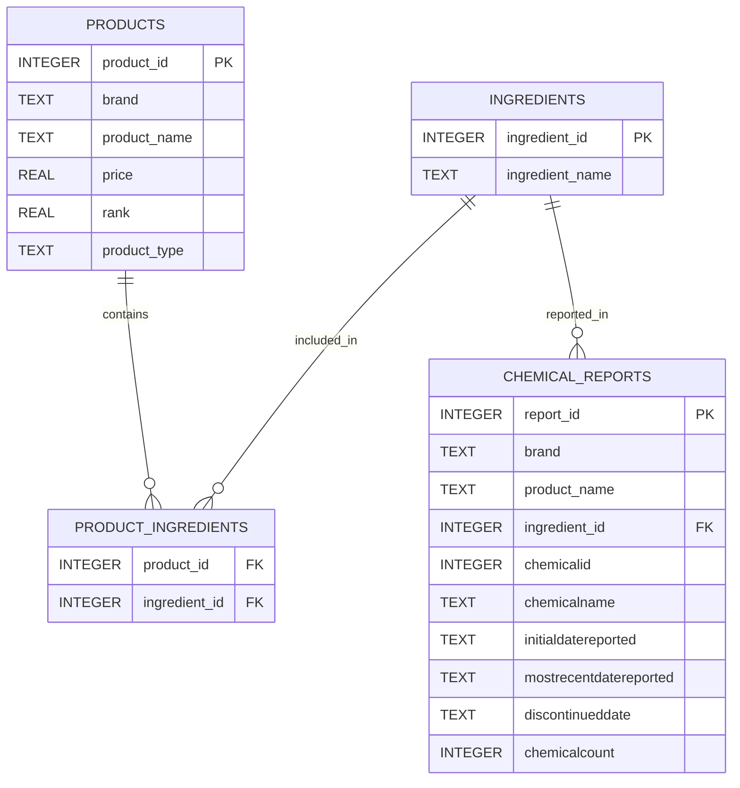

# Beauty Wizard  
**Cosmetic Ingredient Transparency & Regulatory Indicators**

> A data analysis capstone project exploring cosmetic product formulations, ingredient usage patterns, and regulatory reporting signals through a relational database and reproducible analytics workflow.

---

## Project Overview

**Beauty Wizard** integrates retail cosmetic product data with government chemical reporting to examine how ingredients are used across products, brands, and categories—and how those patterns intersect with regulatory signals.

Rather than labeling products or brands as “safe” or “unsafe,” this project focuses on **transparency, formulation complexity, and reporting prevalence**, giving analytical context to how ingredients appear in the marketplace and in public regulatory datasets.

All analyses are fully reproducible via a single Jupyter Notebook and a SQLite database.

---

## Core Questions

- Which ingredients are most prevalent across cosmetic products?
- How complex are typical cosmetic formulations?
- Do higher-priced or higher-ranked products differ in ingredient diversity?
- Which ingredients and brands appear most frequently in regulatory reporting datasets?
- How does regulatory exposure differ when measured at the ingredient, product, or brand level?

---

## Data Sources

This project combines **three independent datasets**:

| Dataset | Description |
|------|-------------|
| **[Sephora Skincare Product Ingredients (Kaggle)](https://www.kaggle.com/datasets/dominoweir/skincare-product-ingredients)** | Retail product listings, prices, rankings, and ingredient text |
| **[BeautyFeeds Skincare & Haircare Dataset](https://app.beautyfeeds.io/sample_datasets/skincare-hair-care-products-with-ingredients?_gl=1*15a4fvl*_ga*MjM1OTEyMDE3LjE3NjE2Nzg1NTY.*_ga_19C9HP125W*czE3NjE2Nzg1NTYkbzEkZzEkdDE3NjE2Nzg1OTkkajE3JGwwJGgw)** | Supplemental ingredient and product metadata |
| **[California Chemicals in Cosmetics](https://data.chhs.ca.gov/dataset/chemicals-in-cosmetics)** | Government chemical reporting data, including reporting timelines and counts |

All datasets were cleaned, standardized, and integrated into a unified schema for analysis.

---

## Methodology

### Data Cleaning & Standardization
- Normalized column names and text fields (case, whitespace, characters)
- Standardized ingredient strings and tokenized ingredient lists
- Applied dataset-specific missing data strategies
- Preserved real-world variability by **flagging**, not removing, outliers

### Ingredient Normalization
- Ingredients were cleaned and lowercased for consistent matching
- Products were expanded to ingredient-level granularity for frequency analysis
- Ingredient names were mapped across datasets prior to database insertion

### Outlier Handling
- Extreme price values identified using the IQR method
- Luxury-priced products retained and transparently flagged
- Outliers included in EDA to reflect real market conditions

---

## Database Design

The project uses **SQLite** to enforce relational integrity and support SQL-driven analysis.

### Core Tables
- **Products** — brand, product name, price, rank, and product type
- **Ingredients** — normalized ingredient master list
- **ProductIngredients** — many-to-many junction table
- **ChemicalReports** — regulatory reporting records linked at the ingredient level

Foreign key constraints are enforced (`PRAGMA foreign_keys = ON`) to ensure data consistency.

A static ER diagram .png is included in the repository under `/schema`.

---

## Exploratory Data Analysis (EDA)

EDA focuses on understanding the **shape of the data** before applying relational queries:

- Ingredient frequency distributions
- Ingredient count distributions by product type
- Product price distribution and outliers
- Price vs. ranking relationships

These views provide context for interpreting later SQL-based analyses.

---

## Advanced SQL Analyses

Three primary SQL-driven analyses anchor the project:

### 1. Formulation Complexity by Brand
- Measures **average number of ingredients per product** by brand
- Highlights differences in formulation strategies
- Clarifies that this metric is **not** ingredient prevalence

### 2. Ingredient Prevalence Across Products
- Identifies ingredients appearing most frequently across products
- Demonstrates that a small subset of ingredients dominates formulations
- Distinct from brand-level complexity analysis

### 3. Regulatory Reporting Exposure
- Evaluated at both **product** and **brand** levels
- Counts unique ingredients appearing in CSCP reports
- Emphasizes that reporting frequency ≠ product safety risk

---

## Key Findings

- Cosmetic formulations rely heavily on a small set of common ingredients, followed by a long tail of less frequent components.
- Most products contain **20 to 40 ingredients**, indicating moderate formulation complexity.
- Ingredient diversity shows **no strong correlation** with price or product rank.
- Regulatory reporting is concentrated among a relatively small subset of ingredients and brands.
- High reporting counts typically reflect **widely used ingredients**, not necessarily elevated safety concerns.

---

## Limitations

- Ingredient presence does not account for concentration or exposure level.
- Regulatory datasets reflect reporting activity, not enforcement actions or health outcomes.
- Dataset coverage varies by brand and product category.
- Results should be interpreted as **analytical signals**, not consumer safety claims.

---

## Future Extensions

Potential next steps include:
- Automated data refresh pipelines
- API-driven product lookups
- Integration of consumer review sentiment
- Expanded regulatory datasets and longitudinal analysis

---

## Reproducibility

- All analysis is contained in a single Jupyter Notebook
- SQLite database generated programmatically
- Command-line Git used throughout development
- Notebook structured for portfolio review and PDF export, if needed

> **Note:** Run all notebook cells from top to bottom to fully reproduce results.

## Repository Structure

beauty_wizard
/data .csv files
/schema ER diagram .img and mermaid script .md
beauty_wizard.ipynb
README.md
requirements.txt