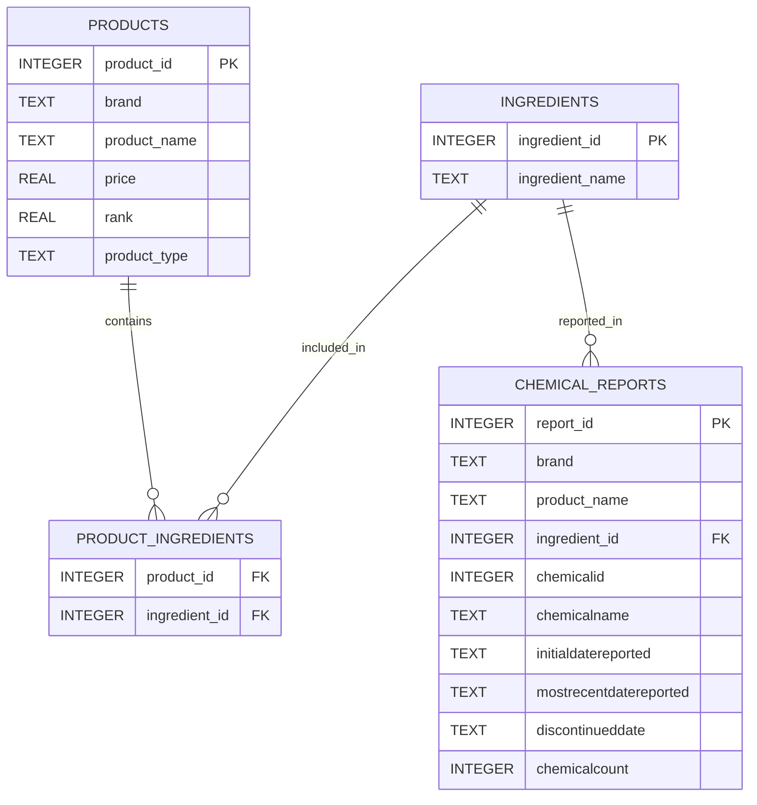

# Used in README.md

```mermaid
erDiagram
    PRODUCTS {
        INTEGER product_id PK
        TEXT brand
        TEXT product_name
        REAL price
        REAL rank
        TEXT product_type
    }

    INGREDIENTS {
        INTEGER ingredient_id PK
        TEXT ingredient_name
    }

    PRODUCT_INGREDIENTS {
        INTEGER product_id FK
        INTEGER ingredient_id FK
    }

    CHEMICAL_REPORTS {
        INTEGER report_id PK
        TEXT brand
        TEXT product_name
        INTEGER ingredient_id FK
        INTEGER chemicalid
        TEXT chemicalname
        TEXT initialdatereported
        TEXT mostrecentdatereported
        TEXT discontinueddate
        INTEGER chemicalcount
    }

    PRODUCTS ||--o{ PRODUCT_INGREDIENTS : contains
    INGREDIENTS ||--o{ PRODUCT_INGREDIENTS : included_in
    INGREDIENTS ||--o{ CHEMICAL_REPORTS : reported_in

```