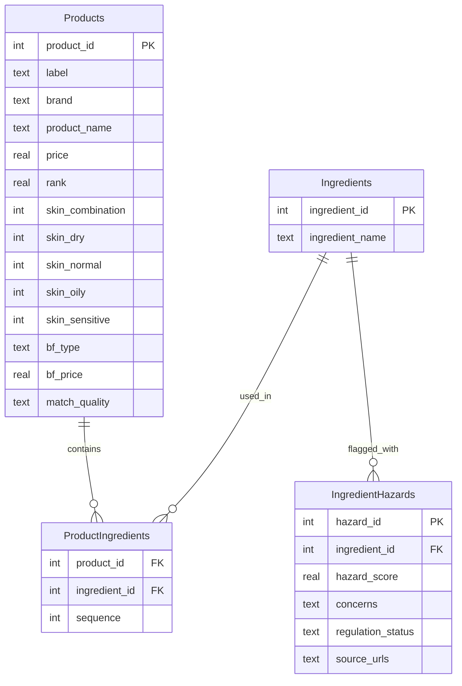

# Used in README.md

```mermaid
erDiagram
  Products ||--o{ ProductIngredients : contains
  Ingredients ||--o{ ProductIngredients : used_in
  Ingredients ||--o{ IngredientHazards : flagged_with

  Products {
    int product_id PK
    text label
    text brand
    text product_name
    real price
    real rank
    int skin_combination
    int skin_dry
    int skin_normal
    int skin_oily
    int skin_sensitive
    text bf_type
    real bf_price
    text match_quality
  }

  Ingredients {
    int ingredient_id PK
    text ingredient_name
  }

  ProductIngredients {
    int product_id FK
    int ingredient_id FK
    int sequence
  }

  IngredientHazards {
    int hazard_id PK
    int ingredient_id FK
    real hazard_score
    text concerns
    text regulation_status
    text source_urls
  }

```